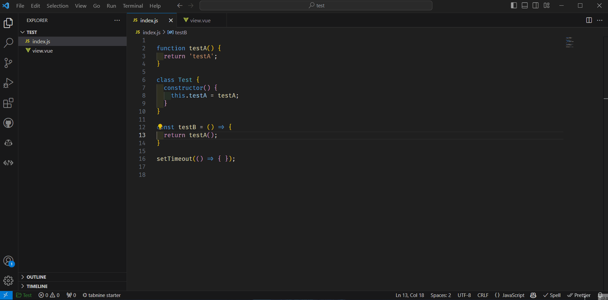
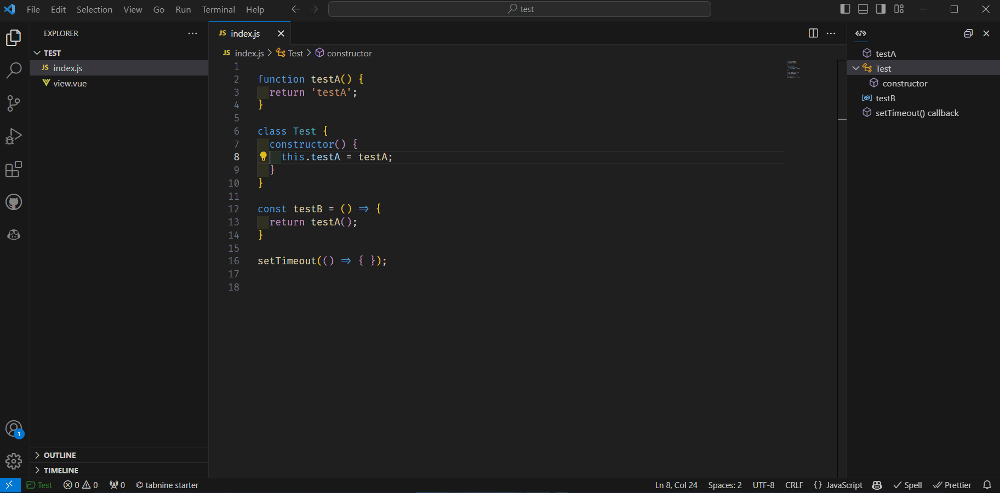

# Simple Code Operator

A simple code operation extension.

## Features

- Code Tree View: Displays a tree view of the code structure in the current document.

- 

- Operations: Use the following shortcuts:

- 
  
- 
  - Select node and navigate: Left mouse button or arrow keys (up/down).
  - Expand/collapse node:  `Space`.
  - Delete code: `Delete` key.
  - Copy code: `Ctrl+C`.
  - Comment code: `/` key.
  - Open context menu: Right-click on a node.
  - Focus on code tree view: `Ctrl+L`.
  - Return to code position: `Enter` or `Esc` in the tree view.

## Extension Settings

* `simple-code-operator.codeSeparator`:  Specifies the list of separators used to split the code. Default value: `[";"]`.
* `simple-code-operator.selectedAreaColor`:  Specifies the background color of the code area when a node is selected. Default value: `"rgba(45, 77, 104, 0.2)"`.
* `simple-code-operator.hiddenItem`:  Specifies the node types that should not be displayed in the tree view. Default value: `[]` (empty).
---

**Enjoy!**
